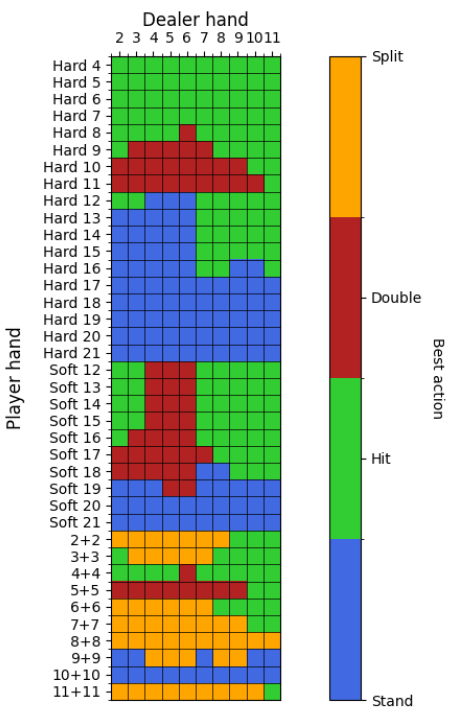
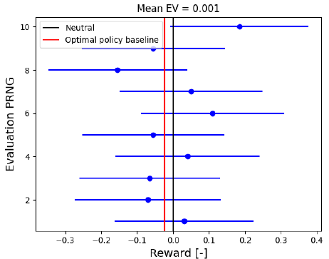

# Beating Blackjack with Deep Reinforcement Learning

Except from a popular casino game, Blackjack is a great setting for training Reinforcement Learning agents to deal with uncertainty. In the beginning if this research project, I investigated the use of Proximal Policy Optimization in Blackjack. Then, I trained the agent to count cards in non-conventional ways. Even though this project is still ongoing, there are promising results that the agent can beat the game of Blackjack, as demonstrated by performing hypothesis testing on the results of inference.

**Key Points:**
- PPO for stochastic games
- Agent deployment and assessment of policy benefits over conventional policy. 
- Development in JAX