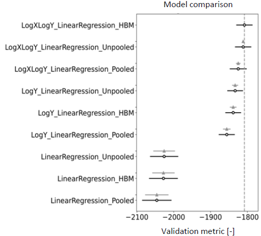

# Hierarchical Bayesian Modelling of Soil Strength

The project aims to derive a strong relationship between two geotechnical variables, *qnet* and *Su*, which are relevant for geotechnical flood risk analysis. Observed pairs of these variables are claimed by geotechnical site investigation over several sites in the Netherlands. The analysis accessed and pre-processed a large Dutch site investigation database. Experience suggests that the relationship between *qnet* and *Su*:
1. shows some individual behavior at every site; and
2. follows a regional trend to some extent.

Based on this, Hierarchical Bayesian Modelling (HBM), or partially pooled modelling, appears as an attractive alternative. The analysis adopted an extensive Bayesian data analysis workflow, in which it examined several approaches to pooling, functional forms and statistical error models in search for a strong relationship between *qnet* and *Su*. But how should the fittest model be selected?

Cross-validation took the spotlight in the analysis. Model selection is tied to the expected use of the model, and so a fitting cross-validation scheme must be adopted for identifying the fittest model. Will the model be used to make predictions within one of the examined sites, or will it be used to predict for an entirely new site? After identifying the fittest model accordingly, its predictions are used in the risk analysis of a flood defense system. Ultimately, the impact of adopting HBM on the accepted risk is quantified.

**Key Points:**
- Hierarchical Bayesian Modelling
- Cross-validation
- Risk analysis

[🔗 View Paper](https://rpsonline.com.sg/proceedings/isrerm2022/html/MS-13-037.xml)